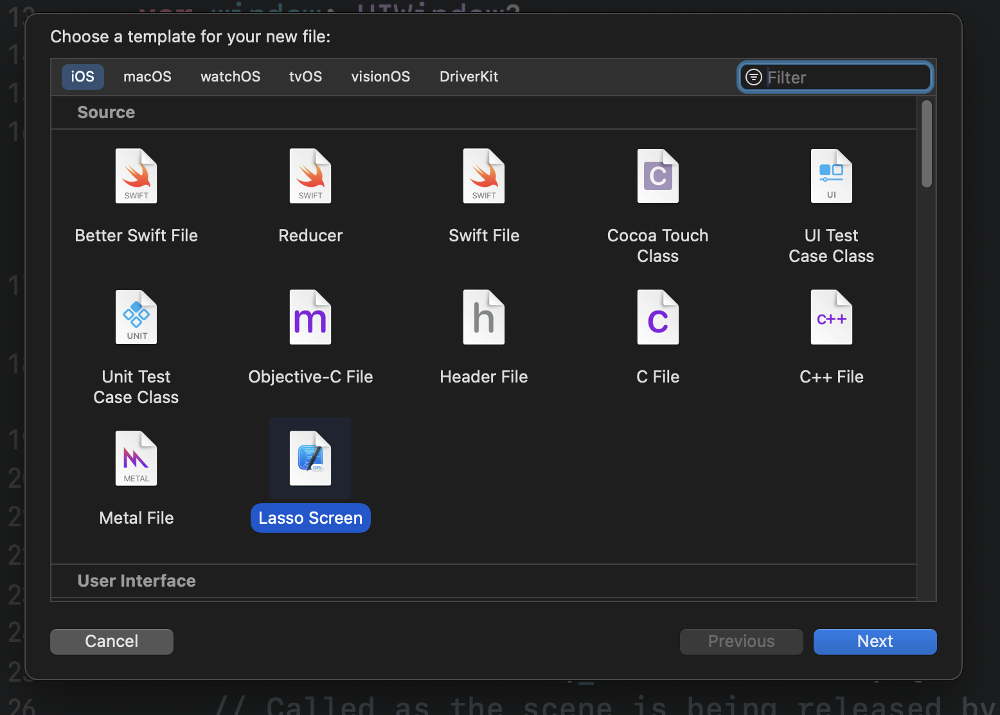

# Lasso Templates

Project template and a file template for [Lasso](https://github.com/ww-tech/lasso).

## Lasso Project


A starting point for a lasso project that uses SwiftUI. Sets up a shared AppFlow with a UIWindow and creates an example flow and screen.

Files include:

1. AppFlow.swift
2. ContentFlow.swift
3. ContentScreen.swift
4. ContentView.swift

## Lasso Screen Files

Generate boiilerplate for a lasso screen




The name used for the screen will be automatically applied to the screen module, store, and view.

#### Example of template output with screen name `Test`:

`TestScreen.swift`
```swift
enum TestScreen: ScreenModule {
    struct State {

    }

    enum Action {
        
    }
    
    enum Output {
        
    }

    static func createScreen(with store: TestStore) -> Screen {
        Screen(store, TestView(store: store.asViewStore()))
    }
    
    static var defaultInitialState: State = State()
}
```

`TestStore.swift`
```swift
final class TestStore: LassoStore<TestScreen> {
    override func handleAction(_ action: LassoStore<TestScreen>.Action) {}
}
```

`TestView.swift`
```swift
struct TestView: View {
    @ObservedObject var store: TestScreen.ViewStore
    
    var body: some View {
        Text("Hello, World!")
    }
}

#Preview {
    TestView(store: TestStore().asViewStore())
}
```